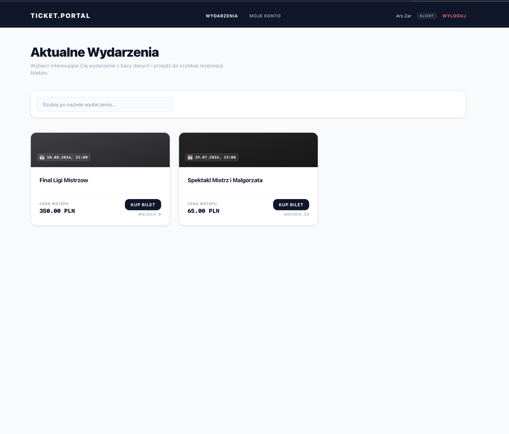
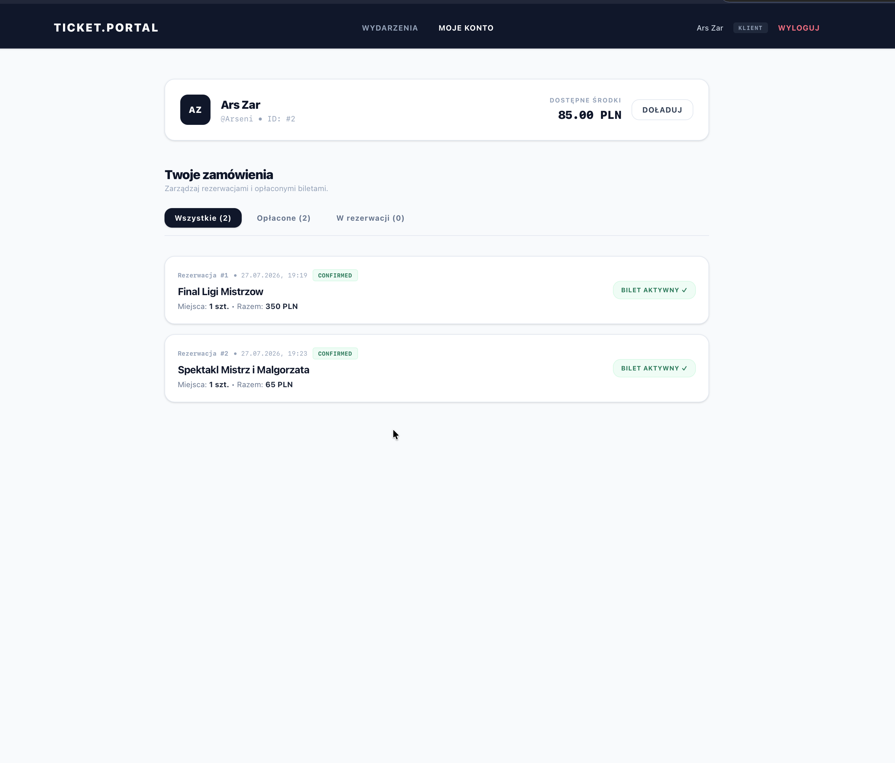
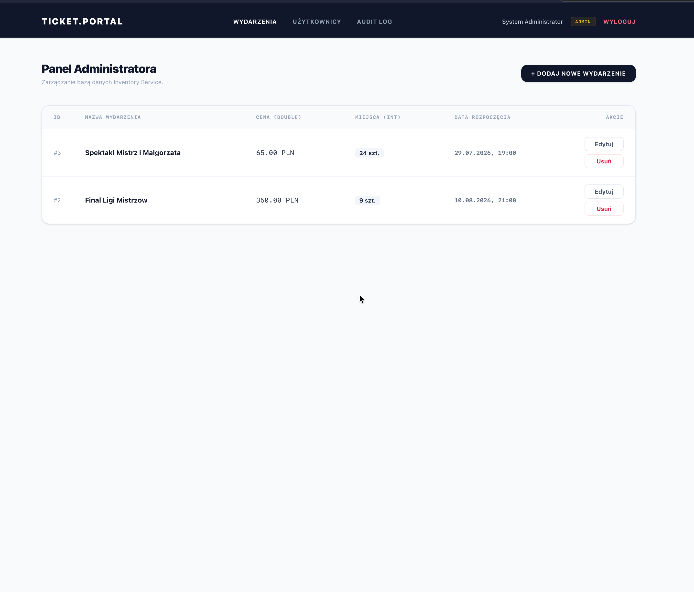
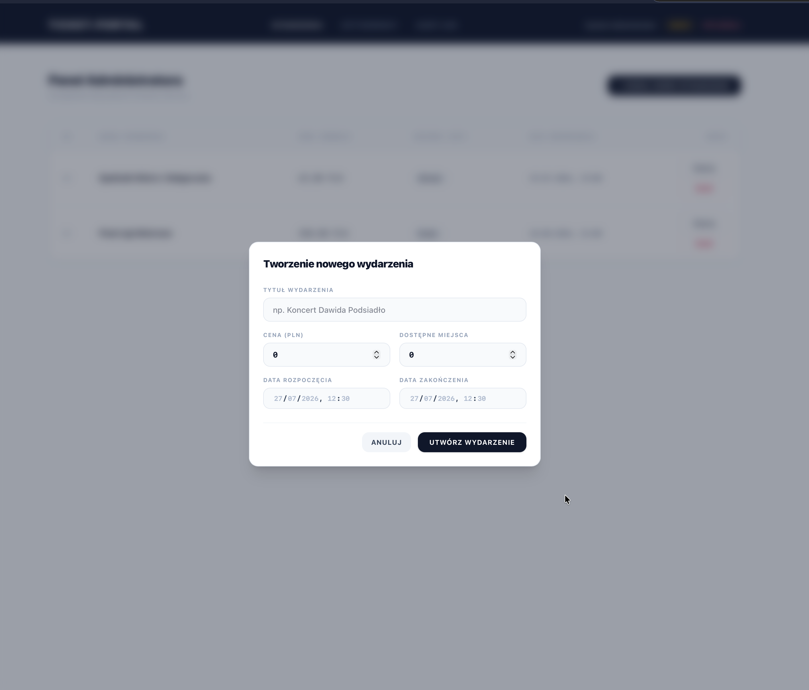
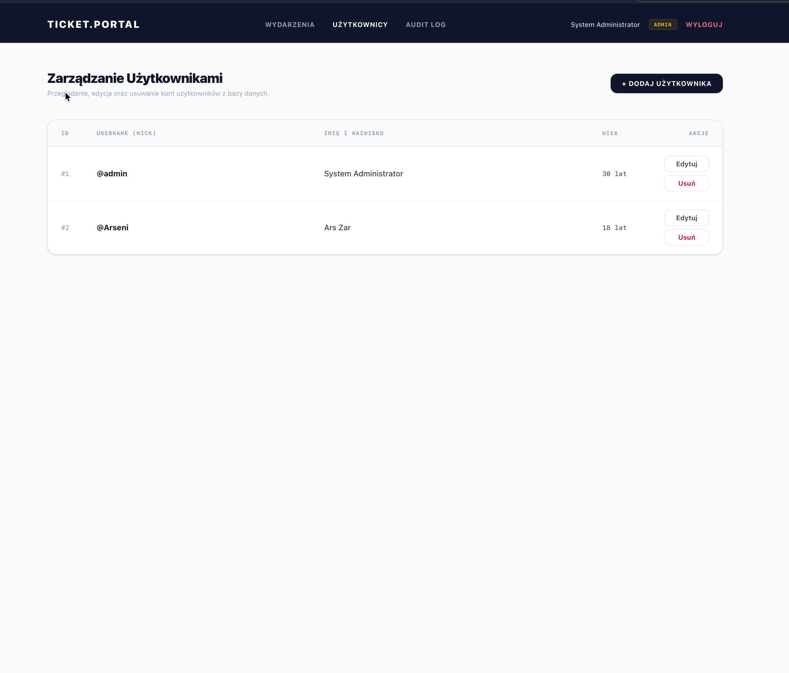
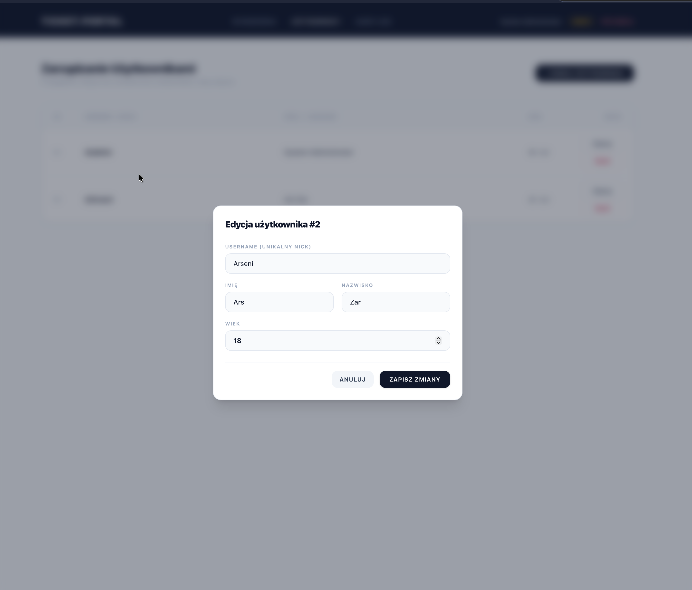
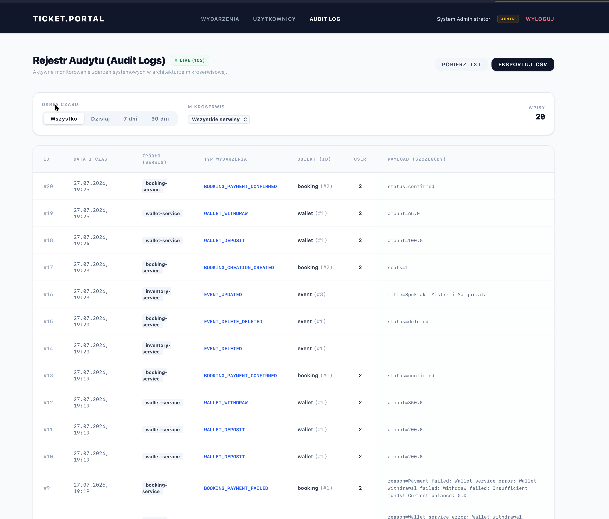

# 🎫 Ticket.Portal — Express Ticket System

A pet/learning project implementing a ticket-selling platform built on **microservice architecture** principles. The system is powered by Spring Boot / Spring Cloud and consists of five independent services, each owning its own business domain and its own database.

The project includes both a client-facing part (buying tickets, personal account, wallet) and a full **admin panel** for managing events, users, and monitoring the audit log in near real time.

---

## 📸 Screenshots

### Events catalog


### Customer account


### Admin panel — event management


### Admin panel — creating a new event


### Admin panel — user management


### Admin panel — editing a user


### Admin panel — audit log (live)


---

## 🏗 Architecture

The backend consists of **5 independent Spring Boot services**, built with Maven. Each service is isolated, has its own PostgreSQL database, and communicates with the others over its own protocol.

| Service | Role | Communication with Booking Service | Database |
|---|---|---|---|
| **Booking Service** | Main gateway. Single entry point for the frontend (REST), orchestrates calls to the other services | REST (client → service) | own (PostgreSQL) |
| **Wallet Service** | CRUD for customer wallets/accounts, deposits and withdrawals | gRPC | own (PostgreSQL) |
| **Inventory Service** | CRUD for events (event data, seats, prices) | SOAP | own (PostgreSQL) |
| **Report Service** | Collects events from all services and stores them as the audit log | RabbitMQ (services push events into Report Service) | own (PostgreSQL) |
| **Eureka Server** | Service Discovery for Spring Cloud — service registration and lookup | — | — |

**Interaction diagram:**

```
                         ┌───────────────────┐
                         │   Frontend (SPA)   │
                         │  React + TS + Vite │
                         └─────────┬──────────┘
                                   │ REST
                                   ▼
                         ┌───────────────────┐
                         │  Booking Service   │◄──────┐
                         │     (Gateway)      │       │ registration
                         └───┬─────────┬──────┘       │ / discovery
                    gRPC     │         │  SOAP         │
                             ▼         ▼               │
                  ┌────────────────┐ ┌──────────────────┐
                  │ Wallet Service │ │ Inventory Service │
                  └────────────────┘ └──────────────────┘
                             │         │
                             │ RabbitMQ (events)
                             ▼         ▼
                       ┌───────────────────┐
                       │  Report Service    │
                       │   (Audit Log DB)   │
                       └───────────────────┘

                       ┌───────────────────┐
                       │  Eureka Server     │  ← Service Discovery
                       └───────────────────┘
```

Every service publishes its own business events (booking creation, wallet withdrawal/deposit, event changes, etc.) to RabbitMQ, from where Report Service consumes them and stores each one as an **Audit Log** entry. This implements end-to-end logging following the "service → Report Service" pattern, without direct dependencies between the services themselves.

---

## 🛠 Tech Stack

**Backend**
- Java + Spring Boot
- Spring Cloud (Eureka — Service Discovery)
- Maven — build tool
- PostgreSQL — a dedicated database per service (Database per Service)
- gRPC — Booking ↔ Wallet communication
- SOAP — Booking ↔ Inventory communication
- RabbitMQ — event delivery to Report Service

**Frontend**
- React
- TypeScript
- Vite

**Infrastructure**
- Docker
- Docker Compose

---

## ⚙️ Features & Business Logic

### User roles
- **Customer** — browse events, book and pay for tickets, top up the wallet, view own orders.
- **Administrator** — manage events (create/edit/delete), manage users, and browse the audit log with filtering by time range and microservice, plus export to `.csv` / `.txt`.

### Authentication
A simplified scheme without tokens or sessions: login is done by comparing the `username`. No JWT or other authentication mechanisms are used — this is a learning implementation focused on demonstrating microservice architecture rather than production-grade security practices.

### Payment & withdrawal logic
When a customer buys a ticket, Booking Service triggers a withdrawal via Wallet Service. If the customer's balance is insufficient:
- the booking is **not cancelled** — it is kept with an "unpaid" status;
- the ticket stays in the customer's account and can be paid for later, at any point once funds are available.

### Audit log
Report Service asynchronously collects events from all microservices via RabbitMQ and stores them in its own database. In the admin panel, the log is displayed in near real time (auto-refreshing), with the ability to:
- filter by time range ("All", "Today", "7 days", "30 days");
- filter by the source microservice;
- export the data to `.csv` and `.txt`.

Log export is implemented **on the frontend**: the backend simply returns the raw log data, and the export file is generated in the browser.

---

## 🚀 Getting Started

### Requirements
- **Docker** and **Docker Compose** installed

No additional `.env` files are required — all settings (ports, database connection strings, queue configuration, etc.) are already defined inside `docker-compose.yml` and the individual service configs.

### Run steps

```bash
# 1. Clone the repository
git clone https://github.com/ArseniZar/Express-Ticket-System.git
cd Express-Ticket-System

# 2. Build and start all services with a single command
docker compose up --build
```

Once started, all 5 backend services, their databases, the message broker, and the frontend application will come up together.

---

## 👤 Default roles

The system ships with a built-in administrator account for accessing the **admin panel**, from which you can manage events, users, and monitor the audit log (see the screenshots above).

---

## 📌 Project status

This is a learning project built to demonstrate a distributed system that combines multiple communication protocols (REST, gRPC, SOAP, RabbitMQ) with the Database per Service principle.
